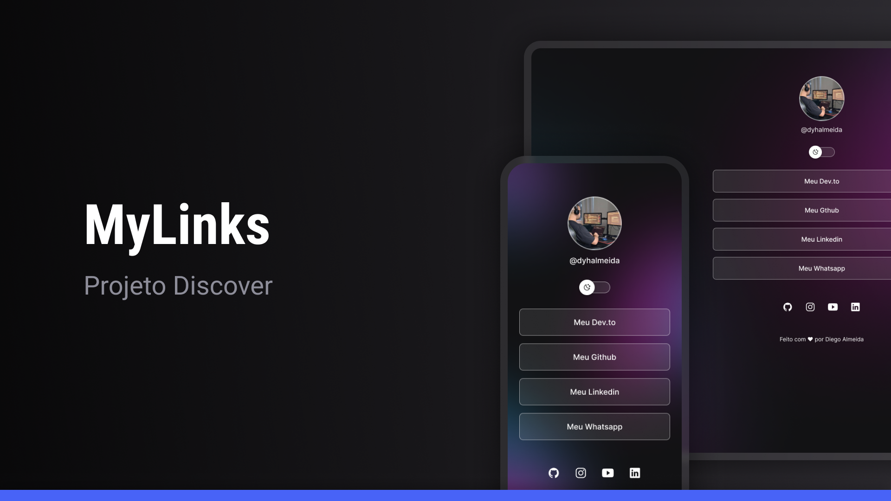

# My Links

A link aggregator application built using HTML, CSS, Javascript and IonIcons. The application also has a dark and light version.

  

## Features

- Implementing dark and light mode

## Installation

To use this project, you need to follow these steps:

1. Clone the repository: `git clone https://github.com/dyhalmeida/my-links.git`
2. Run the application: `index.html`

## Used Tools

This project uses the following tools:

- [HTML](#) for page structure
- [CSS](#) for styles
- [Javascript](#) for dark and light mode
- [Ionicons](https://ionic.io/ionicons/usage) for icons
